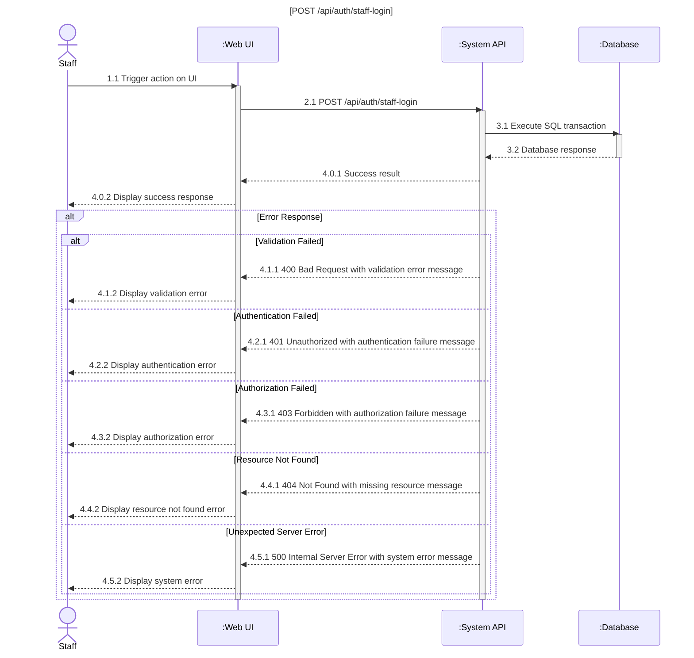
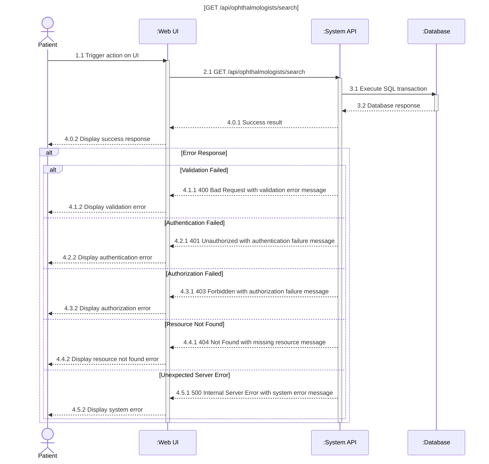
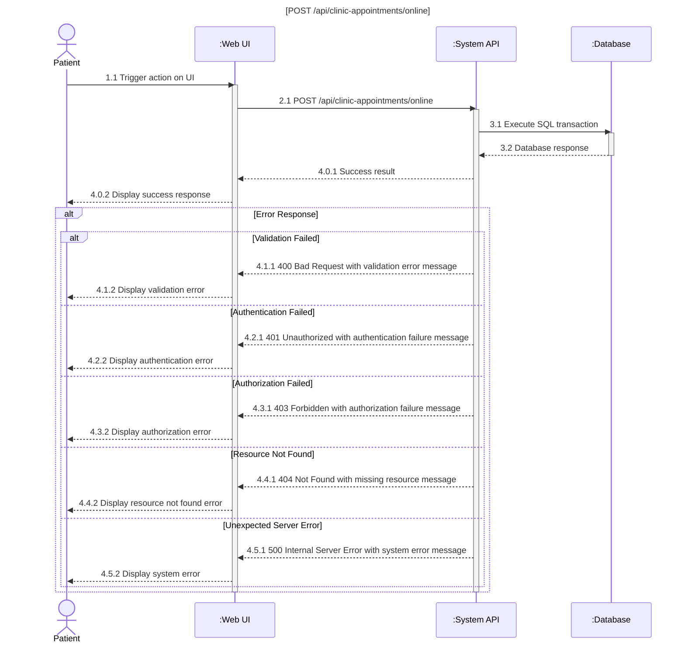
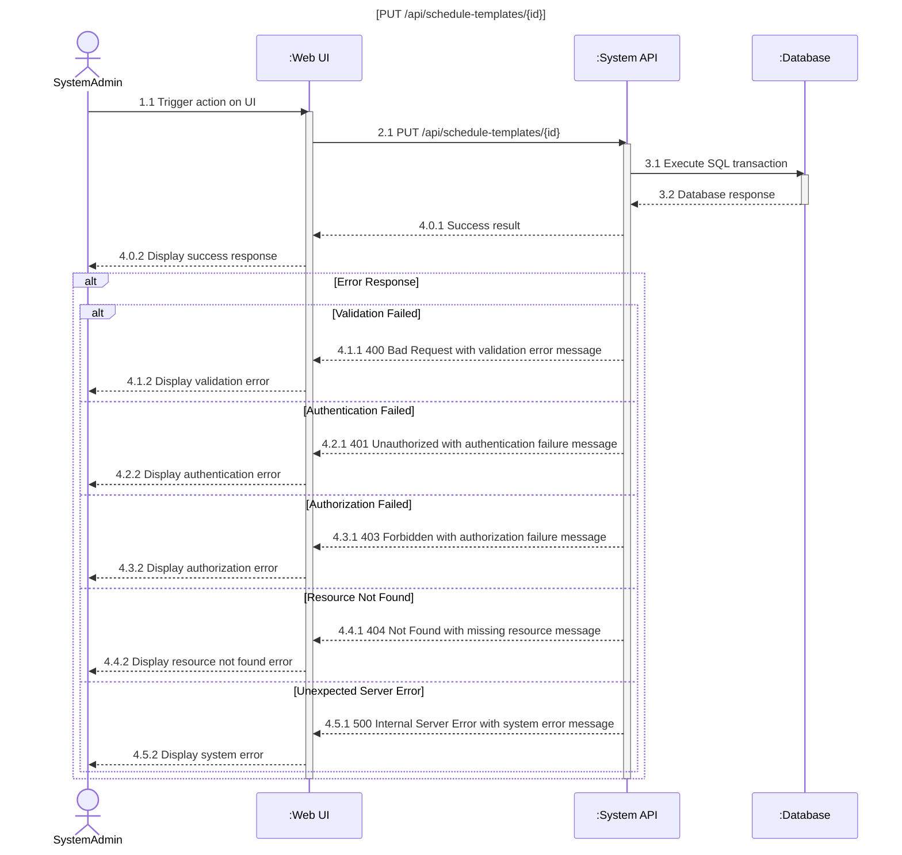

# AuraEyes Sequence Diagrams

[This file contains Mermaid sequence diagrams for all AuraEyes system flows]

## Table of Contents

- 3.1 Authentication & Authorization
- 3.2 User Profile & Leave Management
- 3.3 Appointment & Scheduling Management
- 3.4 Clinical Operations & AI Integration
- 3.5 Financial & Checkout Operations
- 3.6 Medical Records & Post-Visit Care
- 3.7 Internal Knowledge Network
- 3.8 System Notification Dispatching

---

## 3.1 Authentication & Authorization

### 3.1.1 Register Patient Account


### 3.1.2 Patient Login (Standard & OAuth 2.0)


### 3.1.3 Internal Staff Secure Login



### 3.1.4 Email Confirmation, Forgot Password, Reset Password


### 3.1.5 Two-Factor Authentication


### 3.1.6 Manage Internal Accounts & RBAC Policies


## 3.2 User Profile & Leave Management

### 3.2.1 Manage Patient Profile


### 3.2.2 Manage Clinic Staff Profile


### 3.2.3 Manage Ophthalmologist Profile & Certificates


### 3.2.4 Submit Leave of Absence Request


### 3.2.5 Process Leave of Absence Request

```mermaid
sequenceDiagram
    title [PUT /api/system-admin/leave-requests/{id}/process]
    actor SystemAdmin
    participant UI as :Web UI
    participant API as :System API
    participant DB as :Database

    SystemAdmin->>UI: 1.1 Trigger action on UI
    activate UI
    UI->>API: 2.1 PUT /api/system-admin/leave-requests/{id}/process
    activate API
    API->>DB: 3.1 Execute SQL transaction
    activate DB
    DB-->>API: 3.2 Database response
    deactivate DB

    API-->>UI: 4.0.1 Success result
    UI-->>SystemAdmin: 4.0.2 Display success response

    alt Error Response
        alt Validation Failed
            API-->>UI: 4.1.1 400 Bad Request with validation error message
            UI-->>SystemAdmin: 4.1.2 Display validation error
        else Authentication Failed
            API-->>UI: 4.2.1 401 Unauthorized with authentication failure message
            UI-->>SystemAdmin: 4.2.2 Display authentication error
        else Authorization Failed
            API-->>UI: 4.3.1 403 Forbidden with authorization failure message
            UI-->>SystemAdmin: 4.3.2 Display authorization error
        else Resource Not Found
            API-->>UI: 4.4.1 404 Not Found with missing resource message
            UI-->>SystemAdmin: 4.4.2 Display resource not found error
        else Unexpected Server Error
            API-->>UI: 4.5.1 500 Internal Server Error with system error message
            UI-->>SystemAdmin: 4.5.2 Display system error
        end
    end

    deactivate API
    deactivate UI
```



## 3.3 Appointment & Scheduling Management

### 3.3.1 Search Ophthalmologists & Available Slots



### 3.3.2 Schedule Appointment



### 3.3.3 Register Walk-in Patient


### 3.3.4 Verify Booking Check-in


### 3.3.5 Manage Schedule Templates



### 3.3.6 Manage Appointment Slots


### 3.3.7 Manage Daily Appointment Schedules


## 3.4 Clinical Operations & AI Integration

### 3.4.1 Upload Retinal Photo & Create Screening Session


### 3.4.2 Capture Patient Consent for Screening


### 3.4.3 Trigger AI Analysis & Save AI Results

```mermaid
sequenceDiagram
    title [POST /api/screenings/trigger-ai]
    actor ClinicStaff
    participant UI as :Web UI
    participant API as :System API
    participant DB as :Database

    ClinicStaff->>UI: 1.1 Trigger action on UI
    activate UI
    UI->>API: 2.1 POST /api/screenings/trigger-ai
    activate API
    API->>DB: 3.1 Execute SQL transaction
    activate DB
    DB-->>API: 3.2 Database response
    deactivate DB

    API-->>UI: 4.0.1 Success result
    UI-->>ClinicStaff: 4.0.2 Display success response

    alt Error Response
        alt Validation Failed
            API-->>UI: 4.1.1 400 Bad Request with validation error message
            UI-->>ClinicStaff: 4.1.2 Display validation error
        else Authentication Failed
            API-->>UI: 4.2.1 401 Unauthorized with authentication failure message
            UI-->>ClinicStaff: 4.2.2 Display authentication error
        else Authorization Failed
            API-->>UI: 4.3.1 403 Forbidden with authorization failure message
            UI-->>ClinicStaff: 4.3.2 Display authorization error
        else Resource Not Found
            API-->>UI: 4.4.1 404 Not Found with missing resource message
            UI-->>ClinicStaff: 4.4.2 Display resource not found error
        else Unexpected Server Error
            API-->>UI: 4.5.1 500 Internal Server Error with system error message
            UI-->>ClinicStaff: 4.5.2 Display system error
        end
    end

    deactivate API
    deactivate UI
```

### 3.4.4 View AI Screening Results & Download PDF

```mermaid
sequenceDiagram
    title [GET /api/ophthalmologist-screenings/{id}/results]
    actor Ophthalmologist
    participant UI as :Web UI
    participant API as :System API
    participant DB as :Database

    Ophthalmologist->>UI: 1.1 Trigger action on UI
    activate UI
    UI->>API: 2.1 GET /api/ophthalmologist-screenings/{id}/results
    activate API
    API->>DB: 3.1 Execute SQL transaction
    activate DB
    DB-->>API: 3.2 Database response
    deactivate DB

    API-->>UI: 4.0.1 Success result
    UI-->>Ophthalmologist: 4.0.2 Display success response

    alt Error Response
        alt Validation Failed
            API-->>UI: 4.1.1 400 Bad Request with validation error message
            UI-->>Ophthalmologist: 4.1.2 Display validation error
        else Authentication Failed
            API-->>UI: 4.2.1 401 Unauthorized with authentication failure message
            UI-->>Ophthalmologist: 4.2.2 Display authentication error
        else Authorization Failed
            API-->>UI: 4.3.1 403 Forbidden with authorization failure message
            UI-->>Ophthalmologist: 4.3.2 Display authorization error
        else Resource Not Found
            API-->>UI: 4.4.1 404 Not Found with missing resource message
            UI-->>Ophthalmologist: 4.4.2 Display resource not found error
        else Unexpected Server Error
            API-->>UI: 4.5.1 500 Internal Server Error with system error message
            UI-->>Ophthalmologist: 4.5.2 Display system error
        end
    end

    deactivate API
    deactivate UI
```

### 3.4.5 Route Patient Cases

```mermaid
sequenceDiagram
    title [PUT /api/screenings/{id}/route]
    actor ClinicStaff
    participant UI as :Web UI
    participant API as :System API
    participant DB as :Database

    ClinicStaff->>UI: 1.1 Trigger action on UI
    activate UI
    UI->>API: 2.1 PUT /api/screenings/{id}/route
    activate API
    API->>DB: 3.1 Execute SQL transaction
    activate DB
    DB-->>API: 3.2 Database response
    deactivate DB

    API-->>UI: 4.0.1 Success result
    UI-->>ClinicStaff: 4.0.2 Display success response

    alt Error Response
        alt Validation Failed
            API-->>UI: 4.1.1 400 Bad Request with validation error message
            UI-->>ClinicStaff: 4.1.2 Display validation error
        else Authentication Failed
            API-->>UI: 4.2.1 401 Unauthorized with authentication failure message
            UI-->>ClinicStaff: 4.2.2 Display authentication error
        else Authorization Failed
            API-->>UI: 4.3.1 403 Forbidden with authorization failure message
            UI-->>ClinicStaff: 4.3.2 Display authorization error
        else Resource Not Found
            API-->>UI: 4.4.1 404 Not Found with missing resource message
            UI-->>ClinicStaff: 4.4.2 Display resource not found error
        else Unexpected Server Error
            API-->>UI: 4.5.1 500 Internal Server Error with system error message
            UI-->>ClinicStaff: 4.5.2 Display system error
        end
    end

    deactivate API
    deactivate UI
```

### 3.4.6 Create Post-Visit Chat Session

```mermaid
sequenceDiagram
    title [POST /api/consultation-sessions]
    actor Patient
    participant UI as :Web UI
    participant API as :System API
    participant DB as :Database

    Patient->>UI: 1.1 Trigger action on UI
    activate UI
    UI->>API: 2.1 POST /api/consultation-sessions
    activate API
    API->>DB: 3.1 Execute SQL transaction
    activate DB
    DB-->>API: 3.2 Database response
    deactivate DB

    API-->>UI: 4.0.1 Success result
    UI-->>Patient: 4.0.2 Display success response

    alt Error Response
        alt Validation Failed
            API-->>UI: 4.1.1 400 Bad Request with validation error message
            UI-->>Patient: 4.1.2 Display validation error
        else Authentication Failed
            API-->>UI: 4.2.1 401 Unauthorized with authentication failure message
            UI-->>Patient: 4.2.2 Display authentication error
        else Authorization Failed
            API-->>UI: 4.3.1 403 Forbidden with authorization failure message
            UI-->>Patient: 4.3.2 Display authorization error
        else Resource Not Found
            API-->>UI: 4.4.1 404 Not Found with missing resource message
            UI-->>Patient: 4.4.2 Display resource not found error
        else Unexpected Server Error
            API-->>UI: 4.5.1 500 Internal Server Error with system error message
            UI-->>Patient: 4.5.2 Display system error
        end
    end

    deactivate API
    deactivate UI
```

### 3.4.7 Real-time Consultation Chat & Media

```mermaid
sequenceDiagram
    title [POST /api/consultation-sessions/{id}/messages]
    actor Ophthalmologist
    participant UI as :Web UI
    participant API as :System API
    participant DB as :Database

    Ophthalmologist->>UI: 1.1 Trigger action on UI
    activate UI
    UI->>API: 2.1 POST /api/consultation-sessions/{id}/messages
    activate API
    API->>DB: 3.1 Execute SQL transaction
    activate DB
    DB-->>API: 3.2 Database response
    deactivate DB

    API-->>UI: 4.0.1 Success result
    UI-->>Ophthalmologist: 4.0.2 Display success response

    alt Error Response
        alt Validation Failed
            API-->>UI: 4.1.1 400 Bad Request with validation error message
            UI-->>Ophthalmologist: 4.1.2 Display validation error
        else Authentication Failed
            API-->>UI: 4.2.1 401 Unauthorized with authentication failure message
            UI-->>Ophthalmologist: 4.2.2 Display authentication error
        else Authorization Failed
            API-->>UI: 4.3.1 403 Forbidden with authorization failure message
            UI-->>Ophthalmologist: 4.3.2 Display authorization error
        else Resource Not Found
            API-->>UI: 4.4.1 404 Not Found with missing resource message
            UI-->>Ophthalmologist: 4.4.2 Display resource not found error
        else Unexpected Server Error
            API-->>UI: 4.5.1 500 Internal Server Error with system error message
            UI-->>Ophthalmologist: 4.5.2 Display system error
        end
    end

    deactivate API
    deactivate UI
```

### 3.4.8 Create Final Medical Diagnosis

```mermaid
sequenceDiagram
    title [POST /api/ophthalmologist-screenings/{id}/diagnosis]
    actor Ophthalmologist
    participant UI as :Web UI
    participant API as :System API
    participant DB as :Database

    Ophthalmologist->>UI: 1.1 Trigger action on UI
    activate UI
    UI->>API: 2.1 POST /api/ophthalmologist-screenings/{id}/diagnosis
    activate API
    API->>DB: 3.1 Execute SQL transaction
    activate DB
    DB-->>API: 3.2 Database response
    deactivate DB

    API-->>UI: 4.0.1 Success result
    UI-->>Ophthalmologist: 4.0.2 Display success response

    alt Error Response
        alt Validation Failed
            API-->>UI: 4.1.1 400 Bad Request with validation error message
            UI-->>Ophthalmologist: 4.1.2 Display validation error
        else Authentication Failed
            API-->>UI: 4.2.1 401 Unauthorized with authentication failure message
            UI-->>Ophthalmologist: 4.2.2 Display authentication error
        else Authorization Failed
            API-->>UI: 4.3.1 403 Forbidden with authorization failure message
            UI-->>Ophthalmologist: 4.3.2 Display authorization error
        else Resource Not Found
            API-->>UI: 4.4.1 404 Not Found with missing resource message
            UI-->>Ophthalmologist: 4.4.2 Display resource not found error
        else Unexpected Server Error
            API-->>UI: 4.5.1 500 Internal Server Error with system error message
            UI-->>Ophthalmologist: 4.5.2 Display system error
        end
    end

    deactivate API
    deactivate UI
```

### 3.4.9 Customize Patient Health Roadmap

```mermaid
sequenceDiagram
    title [POST /api/patient-roadmaps]
    actor Ophthalmologist
    participant UI as :Web UI
    participant API as :System API
    participant DB as :Database

    Ophthalmologist->>UI: 1.1 Trigger action on UI
    activate UI
    UI->>API: 2.1 POST /api/patient-roadmaps
    activate API
    API->>DB: 3.1 Execute SQL transaction
    activate DB
    DB-->>API: 3.2 Database response
    deactivate DB

    API-->>UI: 4.0.1 Success result
    UI-->>Ophthalmologist: 4.0.2 Display success response

    alt Error Response
        alt Validation Failed
            API-->>UI: 4.1.1 400 Bad Request with validation error message
            UI-->>Ophthalmologist: 4.1.2 Display validation error
        else Authentication Failed
            API-->>UI: 4.2.1 401 Unauthorized with authentication failure message
            UI-->>Ophthalmologist: 4.2.2 Display authentication error
        else Authorization Failed
            API-->>UI: 4.3.1 403 Forbidden with authorization failure message
            UI-->>Ophthalmologist: 4.3.2 Display authorization error
        else Resource Not Found
            API-->>UI: 4.4.1 404 Not Found with missing resource message
            UI-->>Ophthalmologist: 4.4.2 Display resource not found error
        else Unexpected Server Error
            API-->>UI: 4.5.1 500 Internal Server Error with system error message
            UI-->>Ophthalmologist: 4.5.2 Display system error
        end
    end

    deactivate API
    deactivate UI
```

## 3.5 Financial & Checkout Operations

### 3.5.1 Build Payment Context from Finalized Visit

```mermaid
sequenceDiagram
    title [GET /api/financial/payment-context/{visitId}]
    actor ClinicStaff
    participant UI as :Web UI
    participant API as :System API
    participant DB as :Database

    ClinicStaff->>UI: 1.1 Trigger action on UI
    activate UI
    UI->>API: 2.1 GET /api/financial/payment-context/{visitId}
    activate API
    API->>DB: 3.1 Execute SQL transaction
    activate DB
    DB-->>API: 3.2 Database response
    deactivate DB

    API-->>UI: 4.0.1 Success result
    UI-->>ClinicStaff: 4.0.2 Display success response

    alt Error Response
        alt Validation Failed
            API-->>UI: 4.1.1 400 Bad Request with validation error message
            UI-->>ClinicStaff: 4.1.2 Display validation error
        else Authentication Failed
            API-->>UI: 4.2.1 401 Unauthorized with authentication failure message
            UI-->>ClinicStaff: 4.2.2 Display authentication error
        else Authorization Failed
            API-->>UI: 4.3.1 403 Forbidden with authorization failure message
            UI-->>ClinicStaff: 4.3.2 Display authorization error
        else Resource Not Found
            API-->>UI: 4.4.1 404 Not Found with missing resource message
            UI-->>ClinicStaff: 4.4.2 Display resource not found error
        else Unexpected Server Error
            API-->>UI: 4.5.1 500 Internal Server Error with system error message
            UI-->>ClinicStaff: 4.5.2 Display system error
        end
    end

    deactivate API
    deactivate UI
```

### 3.5.2 Create Clinical Payment Order

```mermaid
sequenceDiagram
    title [POST /api/financial/orders]
    actor ClinicStaff
    participant UI as :Web UI
    participant API as :System API
    participant DB as :Database

    ClinicStaff->>UI: 1.1 Trigger action on UI
    activate UI
    UI->>API: 2.1 POST /api/financial/orders
    activate API
    API->>DB: 3.1 Execute SQL transaction
    activate DB
    DB-->>API: 3.2 Database response
    deactivate DB

    API-->>UI: 4.0.1 Success result
    UI-->>ClinicStaff: 4.0.2 Display success response

    alt Error Response
        alt Validation Failed
            API-->>UI: 4.1.1 400 Bad Request with validation error message
            UI-->>ClinicStaff: 4.1.2 Display validation error
        else Authentication Failed
            API-->>UI: 4.2.1 401 Unauthorized with authentication failure message
            UI-->>ClinicStaff: 4.2.2 Display authentication error
        else Authorization Failed
            API-->>UI: 4.3.1 403 Forbidden with authorization failure message
            UI-->>ClinicStaff: 4.3.2 Display authorization error
        else Resource Not Found
            API-->>UI: 4.4.1 404 Not Found with missing resource message
            UI-->>ClinicStaff: 4.4.2 Display resource not found error
        else Unexpected Server Error
            API-->>UI: 4.5.1 500 Internal Server Error with system error message
            UI-->>ClinicStaff: 4.5.2 Display system error
        end
    end

    deactivate API
    deactivate UI
```

### 3.5.3 Complete Transaction (Cash/Gateway)

```mermaid
sequenceDiagram
    title [POST /api/financial/checkout]
    actor ClinicStaff
    participant UI as :Web UI
    participant API as :System API
    participant DB as :Database

    ClinicStaff->>UI: 1.1 Trigger action on UI
    activate UI
    UI->>API: 2.1 POST /api/financial/checkout
    activate API
    API->>DB: 3.1 Execute SQL transaction
    activate DB
    DB-->>API: 3.2 Database response
    deactivate DB

    API-->>UI: 4.0.1 Success result
    UI-->>ClinicStaff: 4.0.2 Display success response

    alt Error Response
        alt Validation Failed
            API-->>UI: 4.1.1 400 Bad Request with validation error message
            UI-->>ClinicStaff: 4.1.2 Display validation error
        else Authentication Failed
            API-->>UI: 4.2.1 401 Unauthorized with authentication failure message
            UI-->>ClinicStaff: 4.2.2 Display authentication error
        else Authorization Failed
            API-->>UI: 4.3.1 403 Forbidden with authorization failure message
            UI-->>ClinicStaff: 4.3.2 Display authorization error
        else Resource Not Found
            API-->>UI: 4.4.1 404 Not Found with missing resource message
            UI-->>ClinicStaff: 4.4.2 Display resource not found error
        else Unexpected Server Error
            API-->>UI: 4.5.1 500 Internal Server Error with system error message
            UI-->>ClinicStaff: 4.5.2 Display system error
        end
    end

    deactivate API
    deactivate UI
```

### 3.5.4 Process Payment Webhook Status

```mermaid
sequenceDiagram
    title [POST /api/financial/webhook]
    actor System
    participant UI as :Web UI
    participant API as :System API
    participant DB as :Database

    System->>UI: 1.1 Trigger action on UI
    activate UI
    UI->>API: 2.1 POST /api/financial/webhook
    activate API
    API->>DB: 3.1 Execute SQL transaction
    activate DB
    DB-->>API: 3.2 Database response
    deactivate DB

    API-->>UI: 4.0.1 Success result
    UI-->>System: 4.0.2 Display success response

    alt Error Response
        alt Validation Failed
            API-->>UI: 4.1.1 400 Bad Request with validation error message
            UI-->>System: 4.1.2 Display validation error
        else Authentication Failed
            API-->>UI: 4.2.1 401 Unauthorized with authentication failure message
            UI-->>System: 4.2.2 Display authentication error
        else Authorization Failed
            API-->>UI: 4.3.1 403 Forbidden with authorization failure message
            UI-->>System: 4.3.2 Display authorization error
        else Resource Not Found
            API-->>UI: 4.4.1 404 Not Found with missing resource message
            UI-->>System: 4.4.2 Display resource not found error
        else Unexpected Server Error
            API-->>UI: 4.5.1 500 Internal Server Error with system error message
            UI-->>System: 4.5.2 Display system error
        end
    end

    deactivate API
    deactivate UI
```

### 3.5.5 View Order Detail & Transaction History

```mermaid
sequenceDiagram
    title [GET /api/financial/transactions]
    actor Patient
    participant UI as :Web UI
    participant API as :System API
    participant DB as :Database

    Patient->>UI: 1.1 Trigger action on UI
    activate UI
    UI->>API: 2.1 GET /api/financial/transactions
    activate API
    API->>DB: 3.1 Execute SQL transaction
    activate DB
    DB-->>API: 3.2 Database response
    deactivate DB

    API-->>UI: 4.0.1 Success result
    UI-->>Patient: 4.0.2 Display success response

    alt Error Response
        alt Validation Failed
            API-->>UI: 4.1.1 400 Bad Request with validation error message
            UI-->>Patient: 4.1.2 Display validation error
        else Authentication Failed
            API-->>UI: 4.2.1 401 Unauthorized with authentication failure message
            UI-->>Patient: 4.2.2 Display authentication error
        else Authorization Failed
            API-->>UI: 4.3.1 403 Forbidden with authorization failure message
            UI-->>Patient: 4.3.2 Display authorization error
        else Resource Not Found
            API-->>UI: 4.4.1 404 Not Found with missing resource message
            UI-->>Patient: 4.4.2 Display resource not found error
        else Unexpected Server Error
            API-->>UI: 4.5.1 500 Internal Server Error with system error message
            UI-->>Patient: 4.5.2 Display system error
        end
    end

    deactivate API
    deactivate UI
```

### 3.5.6 Monitor Operational & Financial Metrics

```mermaid
sequenceDiagram
    title [GET /api/financial/metrics]
    actor SystemAdmin
    participant UI as :Web UI
    participant API as :System API
    participant DB as :Database

    SystemAdmin->>UI: 1.1 Trigger action on UI
    activate UI
    UI->>API: 2.1 GET /api/financial/metrics
    activate API
    API->>DB: 3.1 Execute SQL transaction
    activate DB
    DB-->>API: 3.2 Database response
    deactivate DB

    API-->>UI: 4.0.1 Success result
    UI-->>SystemAdmin: 4.0.2 Display success response

    alt Error Response
        alt Validation Failed
            API-->>UI: 4.1.1 400 Bad Request with validation error message
            UI-->>SystemAdmin: 4.1.2 Display validation error
        else Authentication Failed
            API-->>UI: 4.2.1 401 Unauthorized with authentication failure message
            UI-->>SystemAdmin: 4.2.2 Display authentication error
        else Authorization Failed
            API-->>UI: 4.3.1 403 Forbidden with authorization failure message
            UI-->>SystemAdmin: 4.3.2 Display authorization error
        else Resource Not Found
            API-->>UI: 4.4.1 404 Not Found with missing resource message
            UI-->>SystemAdmin: 4.4.2 Display resource not found error
        else Unexpected Server Error
            API-->>UI: 4.5.1 500 Internal Server Error with system error message
            UI-->>SystemAdmin: 4.5.2 Display system error
        end
    end

    deactivate API
    deactivate UI
```

### 3.5.7 Configure Service Pricing Rules

```mermaid
sequenceDiagram
    title [PUT /api/system-settings/pricing]
    actor SystemAdmin
    participant UI as :Web UI
    participant API as :System API
    participant DB as :Database

    SystemAdmin->>UI: 1.1 Trigger action on UI
    activate UI
    UI->>API: 2.1 PUT /api/system-settings/pricing
    activate API
    API->>DB: 3.1 Execute SQL transaction
    activate DB
    DB-->>API: 3.2 Database response
    deactivate DB

    API-->>UI: 4.0.1 Success result
    UI-->>SystemAdmin: 4.0.2 Display success response

    alt Error Response
        alt Validation Failed
            API-->>UI: 4.1.1 400 Bad Request with validation error message
            UI-->>SystemAdmin: 4.1.2 Display validation error
        else Authentication Failed
            API-->>UI: 4.2.1 401 Unauthorized with authentication failure message
            UI-->>SystemAdmin: 4.2.2 Display authentication error
        else Authorization Failed
            API-->>UI: 4.3.1 403 Forbidden with authorization failure message
            UI-->>SystemAdmin: 4.3.2 Display authorization error
        else Resource Not Found
            API-->>UI: 4.4.1 404 Not Found with missing resource message
            UI-->>SystemAdmin: 4.4.2 Display resource not found error
        else Unexpected Server Error
            API-->>UI: 4.5.1 500 Internal Server Error with system error message
            UI-->>SystemAdmin: 4.5.2 Display system error
        end
    end

    deactivate API
    deactivate UI
```

## 3.6 Medical Records & Post-Visit Care

### 3.6.1 View Patient Medical History

```mermaid
sequenceDiagram
    title [GET /api/patients/{id}/history]
    actor Patient
    participant UI as :Web UI
    participant API as :System API
    participant DB as :Database

    Patient->>UI: 1.1 Trigger action on UI
    activate UI
    UI->>API: 2.1 GET /api/patients/{id}/history
    activate API
    API->>DB: 3.1 Execute SQL transaction
    activate DB
    DB-->>API: 3.2 Database response
    deactivate DB

    API-->>UI: 4.0.1 Success result
    UI-->>Patient: 4.0.2 Display success response

    alt Error Response
        alt Validation Failed
            API-->>UI: 4.1.1 400 Bad Request with validation error message
            UI-->>Patient: 4.1.2 Display validation error
        else Authentication Failed
            API-->>UI: 4.2.1 401 Unauthorized with authentication failure message
            UI-->>Patient: 4.2.2 Display authentication error
        else Authorization Failed
            API-->>UI: 4.3.1 403 Forbidden with authorization failure message
            UI-->>Patient: 4.3.2 Display authorization error
        else Resource Not Found
            API-->>UI: 4.4.1 404 Not Found with missing resource message
            UI-->>Patient: 4.4.2 Display resource not found error
        else Unexpected Server Error
            API-->>UI: 4.5.1 500 Internal Server Error with system error message
            UI-->>Patient: 4.5.2 Display system error
        end
    end

    deactivate API
    deactivate UI
```

### 3.6.2 View & Download Clinical Results

```mermaid
sequenceDiagram
    title [GET /api/patient-roadmaps/{id}/download]
    actor Patient
    participant UI as :Web UI
    participant API as :System API
    participant DB as :Database

    Patient->>UI: 1.1 Trigger action on UI
    activate UI
    UI->>API: 2.1 GET /api/patient-roadmaps/{id}/download
    activate API
    API->>DB: 3.1 Execute SQL transaction
    activate DB
    DB-->>API: 3.2 Database response
    deactivate DB

    API-->>UI: 4.0.1 Success result
    UI-->>Patient: 4.0.2 Display success response

    alt Error Response
        alt Validation Failed
            API-->>UI: 4.1.1 400 Bad Request with validation error message
            UI-->>Patient: 4.1.2 Display validation error
        else Authentication Failed
            API-->>UI: 4.2.1 401 Unauthorized with authentication failure message
            UI-->>Patient: 4.2.2 Display authentication error
        else Authorization Failed
            API-->>UI: 4.3.1 403 Forbidden with authorization failure message
            UI-->>Patient: 4.3.2 Display authorization error
        else Resource Not Found
            API-->>UI: 4.4.1 404 Not Found with missing resource message
            UI-->>Patient: 4.4.2 Display resource not found error
        else Unexpected Server Error
            API-->>UI: 4.5.1 500 Internal Server Error with system error message
            UI-->>Patient: 4.5.2 Display system error
        end
    end

    deactivate API
    deactivate UI
```

### 3.6.3 Work with EMR Clinical Forms

```mermaid
sequenceDiagram
    title [POST /api/emr/forms]
    actor Ophthalmologist
    participant UI as :Web UI
    participant API as :System API
    participant DB as :Database

    Ophthalmologist->>UI: 1.1 Trigger action on UI
    activate UI
    UI->>API: 2.1 POST /api/emr/forms
    activate API
    API->>DB: 3.1 Execute SQL transaction
    activate DB
    DB-->>API: 3.2 Database response
    deactivate DB

    API-->>UI: 4.0.1 Success result
    UI-->>Ophthalmologist: 4.0.2 Display success response

    alt Error Response
        alt Validation Failed
            API-->>UI: 4.1.1 400 Bad Request with validation error message
            UI-->>Ophthalmologist: 4.1.2 Display validation error
        else Authentication Failed
            API-->>UI: 4.2.1 401 Unauthorized with authentication failure message
            UI-->>Ophthalmologist: 4.2.2 Display authentication error
        else Authorization Failed
            API-->>UI: 4.3.1 403 Forbidden with authorization failure message
            UI-->>Ophthalmologist: 4.3.2 Display authorization error
        else Resource Not Found
            API-->>UI: 4.4.1 404 Not Found with missing resource message
            UI-->>Ophthalmologist: 4.4.2 Display resource not found error
        else Unexpected Server Error
            API-->>UI: 4.5.1 500 Internal Server Error with system error message
            UI-->>Ophthalmologist: 4.5.2 Display system error
        end
    end

    deactivate API
    deactivate UI
```

### 3.6.4 Initiate Post-Visit Follow-up

```mermaid
sequenceDiagram
    title [POST /api/consultation-sessions]
    actor Patient
    participant UI as :Web UI
    participant API as :System API
    participant DB as :Database

    Patient->>UI: 1.1 Trigger action on UI
    activate UI
    UI->>API: 2.1 POST /api/consultation-sessions
    activate API
    API->>DB: 3.1 Execute SQL transaction
    activate DB
    DB-->>API: 3.2 Database response
    deactivate DB

    API-->>UI: 4.0.1 Success result
    UI-->>Patient: 4.0.2 Display success response

    alt Error Response
        alt Validation Failed
            API-->>UI: 4.1.1 400 Bad Request with validation error message
            UI-->>Patient: 4.1.2 Display validation error
        else Authentication Failed
            API-->>UI: 4.2.1 401 Unauthorized with authentication failure message
            UI-->>Patient: 4.2.2 Display authentication error
        else Authorization Failed
            API-->>UI: 4.3.1 403 Forbidden with authorization failure message
            UI-->>Patient: 4.3.2 Display authorization error
        else Resource Not Found
            API-->>UI: 4.4.1 404 Not Found with missing resource message
            UI-->>Patient: 4.4.2 Display resource not found error
        else Unexpected Server Error
            API-->>UI: 4.5.1 500 Internal Server Error with system error message
            UI-->>Patient: 4.5.2 Display system error
        end
    end

    deactivate API
    deactivate UI
```

### 3.6.5 Respond to Post-Visit Follow-up

```mermaid
sequenceDiagram
    title [POST /api/consultation-sessions/{id}/messages]
    actor Ophthalmologist
    participant UI as :Web UI
    participant API as :System API
    participant DB as :Database

    Ophthalmologist->>UI: 1.1 Trigger action on UI
    activate UI
    UI->>API: 2.1 POST /api/consultation-sessions/{id}/messages
    activate API
    API->>DB: 3.1 Execute SQL transaction
    activate DB
    DB-->>API: 3.2 Database response
    deactivate DB

    API-->>UI: 4.0.1 Success result
    UI-->>Ophthalmologist: 4.0.2 Display success response

    alt Error Response
        alt Validation Failed
            API-->>UI: 4.1.1 400 Bad Request with validation error message
            UI-->>Ophthalmologist: 4.1.2 Display validation error
        else Authentication Failed
            API-->>UI: 4.2.1 401 Unauthorized with authentication failure message
            UI-->>Ophthalmologist: 4.2.2 Display authentication error
        else Authorization Failed
            API-->>UI: 4.3.1 403 Forbidden with authorization failure message
            UI-->>Ophthalmologist: 4.3.2 Display authorization error
        else Resource Not Found
            API-->>UI: 4.4.1 404 Not Found with missing resource message
            UI-->>Ophthalmologist: 4.4.2 Display resource not found error
        else Unexpected Server Error
            API-->>UI: 4.5.1 500 Internal Server Error with system error message
            UI-->>Ophthalmologist: 4.5.2 Display system error
        end
    end

    deactivate API
    deactivate UI
```

### 3.6.6 Submit Post-visit Feedback

```mermaid
sequenceDiagram
    title [POST /api/feedback]
    actor Patient
    participant UI as :Web UI
    participant API as :System API
    participant DB as :Database

    Patient->>UI: 1.1 Trigger action on UI
    activate UI
    UI->>API: 2.1 POST /api/feedback
    activate API
    API->>DB: 3.1 Execute SQL transaction
    activate DB
    DB-->>API: 3.2 Database response
    deactivate DB

    API-->>UI: 4.0.1 Success result
    UI-->>Patient: 4.0.2 Display success response

    alt Error Response
        alt Validation Failed
            API-->>UI: 4.1.1 400 Bad Request with validation error message
            UI-->>Patient: 4.1.2 Display validation error
        else Authentication Failed
            API-->>UI: 4.2.1 401 Unauthorized with authentication failure message
            UI-->>Patient: 4.2.2 Display authentication error
        else Authorization Failed
            API-->>UI: 4.3.1 403 Forbidden with authorization failure message
            UI-->>Patient: 4.3.2 Display authorization error
        else Resource Not Found
            API-->>UI: 4.4.1 404 Not Found with missing resource message
            UI-->>Patient: 4.4.2 Display resource not found error
        else Unexpected Server Error
            API-->>UI: 4.5.1 500 Internal Server Error with system error message
            UI-->>Patient: 4.5.2 Display system error
        end
    end

    deactivate API
    deactivate UI
```

### 3.6.7 View Patient Educational Resources

```mermaid
sequenceDiagram
    title [GET /api/educational-resources]
    actor Patient
    participant UI as :Web UI
    participant API as :System API
    participant DB as :Database

    Patient->>UI: 1.1 Trigger action on UI
    activate UI
    UI->>API: 2.1 GET /api/educational-resources
    activate API
    API->>DB: 3.1 Execute SQL transaction
    activate DB
    DB-->>API: 3.2 Database response
    deactivate DB

    API-->>UI: 4.0.1 Success result
    UI-->>Patient: 4.0.2 Display success response

    alt Error Response
        alt Validation Failed
            API-->>UI: 4.1.1 400 Bad Request with validation error message
            UI-->>Patient: 4.1.2 Display validation error
        else Authentication Failed
            API-->>UI: 4.2.1 401 Unauthorized with authentication failure message
            UI-->>Patient: 4.2.2 Display authentication error
        else Authorization Failed
            API-->>UI: 4.3.1 403 Forbidden with authorization failure message
            UI-->>Patient: 4.3.2 Display authorization error
        else Resource Not Found
            API-->>UI: 4.4.1 404 Not Found with missing resource message
            UI-->>Patient: 4.4.2 Display resource not found error
        else Unexpected Server Error
            API-->>UI: 4.5.1 500 Internal Server Error with system error message
            UI-->>Patient: 4.5.2 Display system error
        end
    end

    deactivate API
    deactivate UI
```

## 3.7 Internal Knowledge Network

### 3.7.1 Share Clinical Cases on Professional Feed

```mermaid
sequenceDiagram
    title [POST /api/network/posts]
    actor Ophthalmologist
    participant UI as :Web UI
    participant API as :System API
    participant DB as :Database

    Ophthalmologist->>UI: 1.1 Trigger action on UI
    activate UI
    UI->>API: 2.1 POST /api/network/posts
    activate API
    API->>DB: 3.1 Execute SQL transaction
    activate DB
    DB-->>API: 3.2 Database response
    deactivate DB

    API-->>UI: 4.0.1 Success result
    UI-->>Ophthalmologist: 4.0.2 Display success response

    alt Error Response
        alt Validation Failed
            API-->>UI: 4.1.1 400 Bad Request with validation error message
            UI-->>Ophthalmologist: 4.1.2 Display validation error
        else Authentication Failed
            API-->>UI: 4.2.1 401 Unauthorized with authentication failure message
            UI-->>Ophthalmologist: 4.2.2 Display authentication error
        else Authorization Failed
            API-->>UI: 4.3.1 403 Forbidden with authorization failure message
            UI-->>Ophthalmologist: 4.3.2 Display authorization error
        else Resource Not Found
            API-->>UI: 4.4.1 404 Not Found with missing resource message
            UI-->>Ophthalmologist: 4.4.2 Display resource not found error
        else Unexpected Server Error
            API-->>UI: 4.5.1 500 Internal Server Error with system error message
            UI-->>Ophthalmologist: 4.5.2 Display system error
        end
    end

    deactivate API
    deactivate UI
```

### 3.7.2 Comment, React, Save, Repost Professional Content

```mermaid
sequenceDiagram
    title [POST /api/network/posts/{id}/react]
    actor Ophthalmologist
    participant UI as :Web UI
    participant API as :System API
    participant DB as :Database

    Ophthalmologist->>UI: 1.1 Trigger action on UI
    activate UI
    UI->>API: 2.1 POST /api/network/posts/{id}/react
    activate API
    API->>DB: 3.1 Execute SQL transaction
    activate DB
    DB-->>API: 3.2 Database response
    deactivate DB

    API-->>UI: 4.0.1 Success result
    UI-->>Ophthalmologist: 4.0.2 Display success response

    alt Error Response
        alt Validation Failed
            API-->>UI: 4.1.1 400 Bad Request with validation error message
            UI-->>Ophthalmologist: 4.1.2 Display validation error
        else Authentication Failed
            API-->>UI: 4.2.1 401 Unauthorized with authentication failure message
            UI-->>Ophthalmologist: 4.2.2 Display authentication error
        else Authorization Failed
            API-->>UI: 4.3.1 403 Forbidden with authorization failure message
            UI-->>Ophthalmologist: 4.3.2 Display authorization error
        else Resource Not Found
            API-->>UI: 4.4.1 404 Not Found with missing resource message
            UI-->>Ophthalmologist: 4.4.2 Display resource not found error
        else Unexpected Server Error
            API-->>UI: 4.5.1 500 Internal Server Error with system error message
            UI-->>Ophthalmologist: 4.5.2 Display system error
        end
    end

    deactivate API
    deactivate UI
```

### 3.7.3 Create & Operate Internal Group Chat

```mermaid
sequenceDiagram
    title [POST /api/network/groups]
    actor Ophthalmologist
    participant UI as :Web UI
    participant API as :System API
    participant DB as :Database

    Ophthalmologist->>UI: 1.1 Trigger action on UI
    activate UI
    UI->>API: 2.1 POST /api/network/groups
    activate API
    API->>DB: 3.1 Execute SQL transaction
    activate DB
    DB-->>API: 3.2 Database response
    deactivate DB

    API-->>UI: 4.0.1 Success result
    UI-->>Ophthalmologist: 4.0.2 Display success response

    alt Error Response
        alt Validation Failed
            API-->>UI: 4.1.1 400 Bad Request with validation error message
            UI-->>Ophthalmologist: 4.1.2 Display validation error
        else Authentication Failed
            API-->>UI: 4.2.1 401 Unauthorized with authentication failure message
            UI-->>Ophthalmologist: 4.2.2 Display authentication error
        else Authorization Failed
            API-->>UI: 4.3.1 403 Forbidden with authorization failure message
            UI-->>Ophthalmologist: 4.3.2 Display authorization error
        else Resource Not Found
            API-->>UI: 4.4.1 404 Not Found with missing resource message
            UI-->>Ophthalmologist: 4.4.2 Display resource not found error
        else Unexpected Server Error
            API-->>UI: 4.5.1 500 Internal Server Error with system error message
            UI-->>Ophthalmologist: 4.5.2 Display system error
        end
    end

    deactivate API
    deactivate UI
```

### 3.7.4 Initiate Peer Collaboration Meeting

```mermaid
sequenceDiagram
    title [POST /api/network/video-calls]
    actor Ophthalmologist
    participant UI as :Web UI
    participant API as :System API
    participant DB as :Database

    Ophthalmologist->>UI: 1.1 Trigger action on UI
    activate UI
    UI->>API: 2.1 POST /api/network/video-calls
    activate API
    API->>DB: 3.1 Execute SQL transaction
    activate DB
    DB-->>API: 3.2 Database response
    deactivate DB

    API-->>UI: 4.0.1 Success result
    UI-->>Ophthalmologist: 4.0.2 Display success response

    alt Error Response
        alt Validation Failed
            API-->>UI: 4.1.1 400 Bad Request with validation error message
            UI-->>Ophthalmologist: 4.1.2 Display validation error
        else Authentication Failed
            API-->>UI: 4.2.1 401 Unauthorized with authentication failure message
            UI-->>Ophthalmologist: 4.2.2 Display authentication error
        else Authorization Failed
            API-->>UI: 4.3.1 403 Forbidden with authorization failure message
            UI-->>Ophthalmologist: 4.3.2 Display authorization error
        else Resource Not Found
            API-->>UI: 4.4.1 404 Not Found with missing resource message
            UI-->>Ophthalmologist: 4.4.2 Display resource not found error
        else Unexpected Server Error
            API-->>UI: 4.5.1 500 Internal Server Error with system error message
            UI-->>Ophthalmologist: 4.5.2 Display system error
        end
    end

    deactivate API
    deactivate UI
```

### 3.7.5 Moderate Internal Network Communications

```mermaid
sequenceDiagram
    title [PUT /api/network/posts/{id}/moderate]
    actor SystemAdmin
    participant UI as :Web UI
    participant API as :System API
    participant DB as :Database

    SystemAdmin->>UI: 1.1 Trigger action on UI
    activate UI
    UI->>API: 2.1 PUT /api/network/posts/{id}/moderate
    activate API
    API->>DB: 3.1 Execute SQL transaction
    activate DB
    DB-->>API: 3.2 Database response
    deactivate DB

    API-->>UI: 4.0.1 Success result
    UI-->>SystemAdmin: 4.0.2 Display success response

    alt Error Response
        alt Validation Failed
            API-->>UI: 4.1.1 400 Bad Request with validation error message
            UI-->>SystemAdmin: 4.1.2 Display validation error
        else Authentication Failed
            API-->>UI: 4.2.1 401 Unauthorized with authentication failure message
            UI-->>SystemAdmin: 4.2.2 Display authentication error
        else Authorization Failed
            API-->>UI: 4.3.1 403 Forbidden with authorization failure message
            UI-->>SystemAdmin: 4.3.2 Display authorization error
        else Resource Not Found
            API-->>UI: 4.4.1 404 Not Found with missing resource message
            UI-->>SystemAdmin: 4.4.2 Display resource not found error
        else Unexpected Server Error
            API-->>UI: 4.5.1 500 Internal Server Error with system error message
            UI-->>SystemAdmin: 4.5.2 Display system error
        end
    end

    deactivate API
    deactivate UI
```

## 3.8 System Notification Dispatching

### 3.8.1 Dispatch Patient Notifications

```mermaid
sequenceDiagram
    title [POST /api/notifications/patient]
    actor System
    participant UI as :Web UI
    participant API as :System API
    participant DB as :Database

    System->>UI: 1.1 Trigger action on UI
    activate UI
    UI->>API: 2.1 POST /api/notifications/patient
    activate API
    API->>DB: 3.1 Execute SQL transaction
    activate DB
    DB-->>API: 3.2 Database response
    deactivate DB

    API-->>UI: 4.0.1 Success result
    UI-->>System: 4.0.2 Display success response

    alt Error Response
        alt Validation Failed
            API-->>UI: 4.1.1 400 Bad Request with validation error message
            UI-->>System: 4.1.2 Display validation error
        else Authentication Failed
            API-->>UI: 4.2.1 401 Unauthorized with authentication failure message
            UI-->>System: 4.2.2 Display authentication error
        else Authorization Failed
            API-->>UI: 4.3.1 403 Forbidden with authorization failure message
            UI-->>System: 4.3.2 Display authorization error
        else Resource Not Found
            API-->>UI: 4.4.1 404 Not Found with missing resource message
            UI-->>System: 4.4.2 Display resource not found error
        else Unexpected Server Error
            API-->>UI: 4.5.1 500 Internal Server Error with system error message
            UI-->>System: 4.5.2 Display system error
        end
    end

    deactivate API
    deactivate UI
```

### 3.8.2 Dispatch Ophthalmologist Notifications

```mermaid
sequenceDiagram
    title [POST /api/notifications/ophthalmologist]
    actor System
    participant UI as :Web UI
    participant API as :System API
    participant DB as :Database

    System->>UI: 1.1 Trigger action on UI
    activate UI
    UI->>API: 2.1 POST /api/notifications/ophthalmologist
    activate API
    API->>DB: 3.1 Execute SQL transaction
    activate DB
    DB-->>API: 3.2 Database response
    deactivate DB

    API-->>UI: 4.0.1 Success result
    UI-->>System: 4.0.2 Display success response

    alt Error Response
        alt Validation Failed
            API-->>UI: 4.1.1 400 Bad Request with validation error message
            UI-->>System: 4.1.2 Display validation error
        else Authentication Failed
            API-->>UI: 4.2.1 401 Unauthorized with authentication failure message
            UI-->>System: 4.2.2 Display authentication error
        else Authorization Failed
            API-->>UI: 4.3.1 403 Forbidden with authorization failure message
            UI-->>System: 4.3.2 Display authorization error
        else Resource Not Found
            API-->>UI: 4.4.1 404 Not Found with missing resource message
            UI-->>System: 4.4.2 Display resource not found error
        else Unexpected Server Error
            API-->>UI: 4.5.1 500 Internal Server Error with system error message
            UI-->>System: 4.5.2 Display system error
        end
    end

    deactivate API
    deactivate UI
```

### 3.8.3 Dispatch Clinic Staff Notifications

```mermaid
sequenceDiagram
    title [POST /api/notifications/staff]
    actor System
    participant UI as :Web UI
    participant API as :System API
    participant DB as :Database

    System->>UI: 1.1 Trigger action on UI
    activate UI
    UI->>API: 2.1 POST /api/notifications/staff
    activate API
    API->>DB: 3.1 Execute SQL transaction
    activate DB
    DB-->>API: 3.2 Database response
    deactivate DB

    API-->>UI: 4.0.1 Success result
    UI-->>System: 4.0.2 Display success response

    alt Error Response
        alt Validation Failed
            API-->>UI: 4.1.1 400 Bad Request with validation error message
            UI-->>System: 4.1.2 Display validation error
        else Authentication Failed
            API-->>UI: 4.2.1 401 Unauthorized with authentication failure message
            UI-->>System: 4.2.2 Display authentication error
        else Authorization Failed
            API-->>UI: 4.3.1 403 Forbidden with authorization failure message
            UI-->>System: 4.3.2 Display authorization error
        else Resource Not Found
            API-->>UI: 4.4.1 404 Not Found with missing resource message
            UI-->>System: 4.4.2 Display resource not found error
        else Unexpected Server Error
            API-->>UI: 4.5.1 500 Internal Server Error with system error message
            UI-->>System: 4.5.2 Display system error
        end
    end

    deactivate API
    deactivate UI
```

### 3.8.4 Dispatch System Admin Notifications

```mermaid
sequenceDiagram
    title [POST /api/notifications/admin]
    actor System
    participant UI as :Web UI
    participant API as :System API
    participant DB as :Database

    System->>UI: 1.1 Trigger action on UI
    activate UI
    UI->>API: 2.1 POST /api/notifications/admin
    activate API
    API->>DB: 3.1 Execute SQL transaction
    activate DB
    DB-->>API: 3.2 Database response
    deactivate DB

    API-->>UI: 4.0.1 Success result
    UI-->>System: 4.0.2 Display success response

    alt Error Response
        alt Validation Failed
            API-->>UI: 4.1.1 400 Bad Request with validation error message
            UI-->>System: 4.1.2 Display validation error
        else Authentication Failed
            API-->>UI: 4.2.1 401 Unauthorized with authentication failure message
            UI-->>System: 4.2.2 Display authentication error
        else Authorization Failed
            API-->>UI: 4.3.1 403 Forbidden with authorization failure message
            UI-->>System: 4.3.2 Display authorization error
        else Resource Not Found
            API-->>UI: 4.4.1 404 Not Found with missing resource message
            UI-->>System: 4.4.2 Display resource not found error
        else Unexpected Server Error
            API-->>UI: 4.5.1 500 Internal Server Error with system error message
            UI-->>System: 4.5.2 Display system error
        end
    end

    deactivate API
    deactivate UI
```

### 3.8.5 Notification Inbox Management

```mermaid
sequenceDiagram
    title [GET /api/notifications]
    actor User
    participant UI as :Web UI
    participant API as :System API
    participant DB as :Database

    User->>UI: 1.1 Trigger action on UI
    activate UI
    UI->>API: 2.1 GET /api/notifications
    activate API
    API->>DB: 3.1 Execute SQL transaction
    activate DB
    DB-->>API: 3.2 Database response
    deactivate DB

    API-->>UI: 4.0.1 Success result
    UI-->>User: 4.0.2 Display success response

    alt Error Response
        alt Validation Failed
            API-->>UI: 4.1.1 400 Bad Request with validation error message
            UI-->>User: 4.1.2 Display validation error
        else Authentication Failed
            API-->>UI: 4.2.1 401 Unauthorized with authentication failure message
            UI-->>User: 4.2.2 Display authentication error
        else Authorization Failed
            API-->>UI: 4.3.1 403 Forbidden with authorization failure message
            UI-->>User: 4.3.2 Display authorization error
        else Resource Not Found
            API-->>UI: 4.4.1 404 Not Found with missing resource message
            UI-->>User: 4.4.2 Display resource not found error
        else Unexpected Server Error
            API-->>UI: 4.5.1 500 Internal Server Error with system error message
            UI-->>User: 4.5.2 Display system error
        end
    end

    deactivate API
    deactivate UI
```

### 3.8.6 Real-time Notification Delivery

```mermaid
sequenceDiagram
    title [WS /api/notifications/stream]
    actor System
    participant UI as :Web UI
    participant API as :System API
    participant DB as :Database

    System->>UI: 1.1 Trigger action on UI
    activate UI
    UI->>API: 2.1 WS /api/notifications/stream
    activate API
    API->>DB: 3.1 Execute SQL transaction
    activate DB
    DB-->>API: 3.2 Database response
    deactivate DB

    API-->>UI: 4.0.1 Success result
    UI-->>System: 4.0.2 Display success response

    alt Error Response
        alt Validation Failed
            API-->>UI: 4.1.1 400 Bad Request with validation error message
            UI-->>System: 4.1.2 Display validation error
        else Authentication Failed
            API-->>UI: 4.2.1 401 Unauthorized with authentication failure message
            UI-->>System: 4.2.2 Display authentication error
        else Authorization Failed
            API-->>UI: 4.3.1 403 Forbidden with authorization failure message
            UI-->>System: 4.3.2 Display authorization error
        else Resource Not Found
            API-->>UI: 4.4.1 404 Not Found with missing resource message
            UI-->>System: 4.4.2 Display resource not found error
        else Unexpected Server Error
            API-->>UI: 4.5.1 500 Internal Server Error with system error message
            UI-->>System: 4.5.2 Display system error
        end
    end

    deactivate API
    deactivate UI
```

### 3.8.7 Role-based Deep Link Notification Routing

```mermaid
sequenceDiagram
    title [GET /api/notifications/{id}/route]
    actor User
    participant UI as :Web UI
    participant API as :System API
    participant DB as :Database

    User->>UI: 1.1 Trigger action on UI
    activate UI
    UI->>API: 2.1 GET /api/notifications/{id}/route
    activate API
    API->>DB: 3.1 Execute SQL transaction
    activate DB
    DB-->>API: 3.2 Database response
    deactivate DB

    API-->>UI: 4.0.1 Success result
    UI-->>User: 4.0.2 Display success response

    alt Error Response
        alt Validation Failed
            API-->>UI: 4.1.1 400 Bad Request with validation error message
            UI-->>User: 4.1.2 Display validation error
        else Authentication Failed
            API-->>UI: 4.2.1 401 Unauthorized with authentication failure message
            UI-->>User: 4.2.2 Display authentication error
        else Authorization Failed
            API-->>UI: 4.3.1 403 Forbidden with authorization failure message
            UI-->>User: 4.3.2 Display authorization error
        else Resource Not Found
            API-->>UI: 4.4.1 404 Not Found with missing resource message
            UI-->>User: 4.4.2 Display resource not found error
        else Unexpected Server Error
            API-->>UI: 4.5.1 500 Internal Server Error with system error message
            UI-->>User: 4.5.2 Display system error
        end
    end

    deactivate API
    deactivate UI
```
