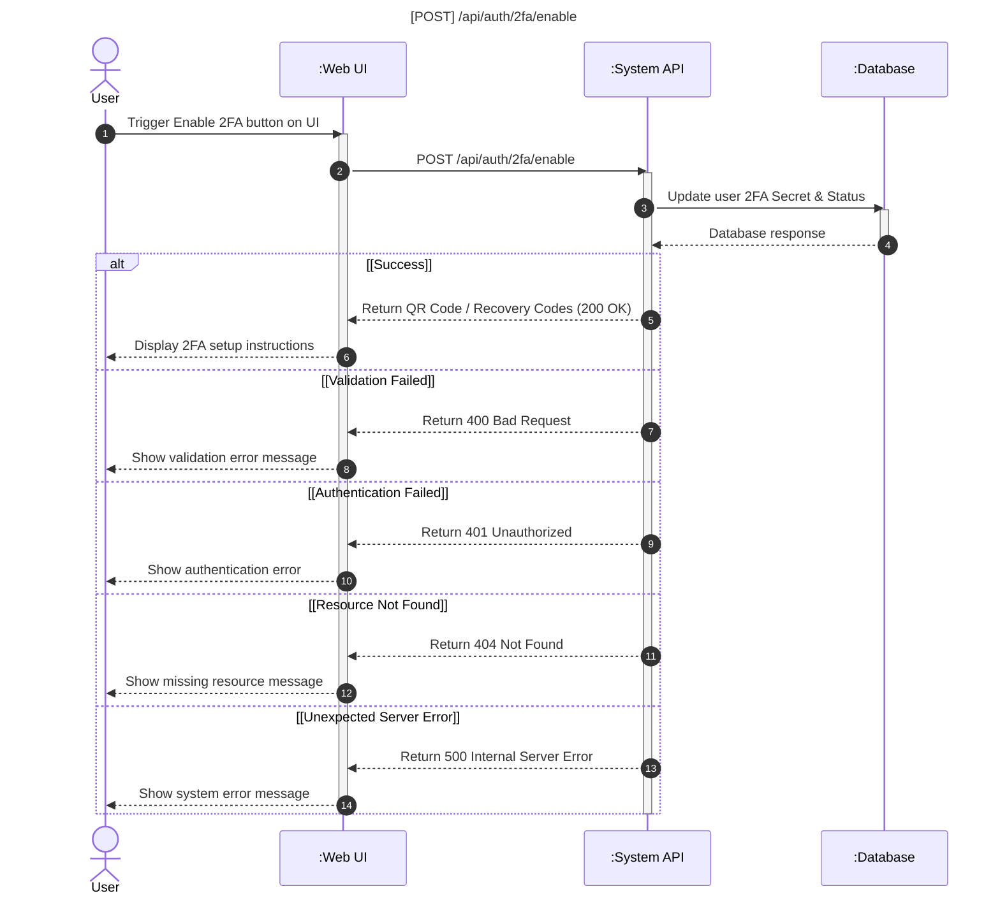
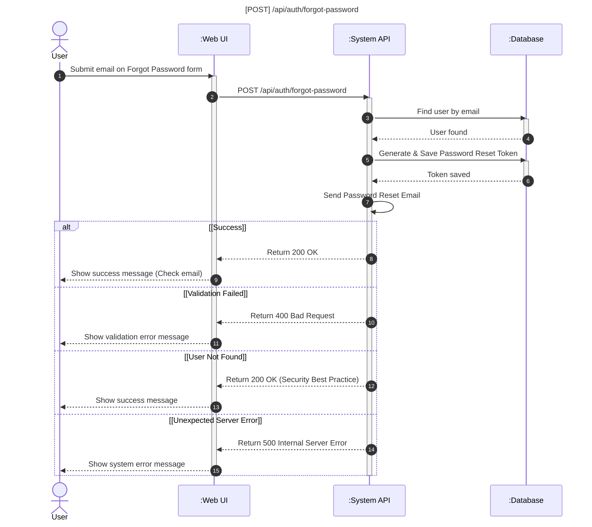
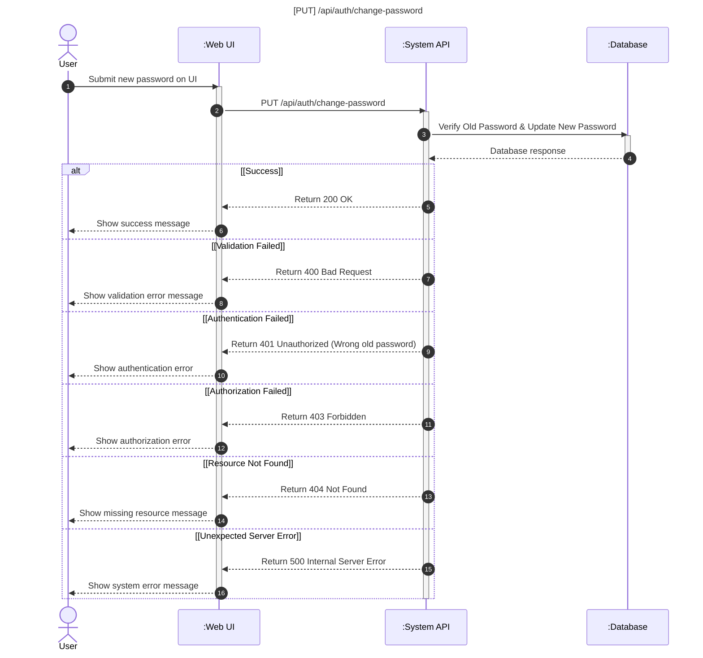

# Auth Sequence Diagrams

## 1. 2FA Enable

```mermaid
sequenceDiagram
    autonumber
    title [POST] /api/auth/2fa/enable
    actor User
    participant UI as :Web UI
    participant API as :System API
    participant DB as :Database

    User->>UI: Trigger Enable 2FA button on UI
    activate UI

    UI->>API: POST /api/auth/2fa/enable
    activate API

    API->>DB: Update user 2FA Secret & Status
    activate DB
    DB-->>API: Database response
    deactivate DB

    alt [Success]
        API-->>UI: Return QR Code / Recovery Codes (200 OK)
        UI-->>User: Display 2FA setup instructions
    else [Validation Failed]
        API-->>UI: Return 400 Bad Request
        UI-->>User: Show validation error message
    else [Authentication Failed]
        API-->>UI: Return 401 Unauthorized
        UI-->>User: Show authentication error
    else [Resource Not Found]
        API-->>UI: Return 404 Not Found
        UI-->>User: Show missing resource message
    else [Unexpected Server Error]
        API-->>UI: Return 500 Internal Server Error
        UI-->>User: Show system error message
    end

    deactivate API
    deactivate UI
```

## 2. Forgot Password

```mermaid
sequenceDiagram
    autonumber
    title [POST] /api/auth/forgot-password
    actor User
    participant UI as :Web UI
    participant API as :System API
    participant DB as :Database

    User->>UI: Submit email on Forgot Password form
    activate UI

    UI->>API: POST /api/auth/forgot-password
    activate API

    API->>DB: Find user by email
    activate DB
    DB-->>API: User found
    deactivate DB

    API->>DB: Generate & Save Password Reset Token
    activate DB
    DB-->>API: Token saved
    deactivate DB

    API->>API: Send Password Reset Email

    alt [Success]
        API-->>UI: Return 200 OK
        UI-->>User: Show success message (Check email)
    else [Validation Failed]
        API-->>UI: Return 400 Bad Request
        UI-->>User: Show validation error message
    else [User Not Found]
        API-->>UI: Return 200 OK (Security Best Practice)
        UI-->>User: Show success message
    else [Unexpected Server Error]
        API-->>UI: Return 500 Internal Server Error
        UI-->>User: Show system error message
    end

    deactivate API
    deactivate UI
```

## 3. Change Password

```mermaid
sequenceDiagram
    autonumber
    title [PUT] /api/auth/change-password
    actor User
    participant UI as :Web UI
    participant API as :System API
    participant DB as :Database

    User->>UI: Submit new password on UI
    activate UI

    UI->>API: PUT /api/auth/change-password
    activate API

    API->>DB: Verify Old Password & Update New Password
    activate DB
    DB-->>API: Database response
    deactivate DB

    alt [Success]
        API-->>UI: Return 200 OK
        UI-->>User: Show success message
    else [Validation Failed]
        API-->>UI: Return 400 Bad Request
        UI-->>User: Show validation error message
    else [Authentication Failed]
        API-->>UI: Return 401 Unauthorized (Wrong old password)
        UI-->>User: Show authentication error
    else [Authorization Failed]
        API-->>UI: Return 403 Forbidden
        UI-->>User: Show authorization error
    else [Resource Not Found]
        API-->>UI: Return 404 Not Found
        UI-->>User: Show missing resource message
    else [Unexpected Server Error]
        API-->>UI: Return 500 Internal Server Error
        UI-->>User: Show system error message
    end

    deactivate API
    deactivate UI
```
