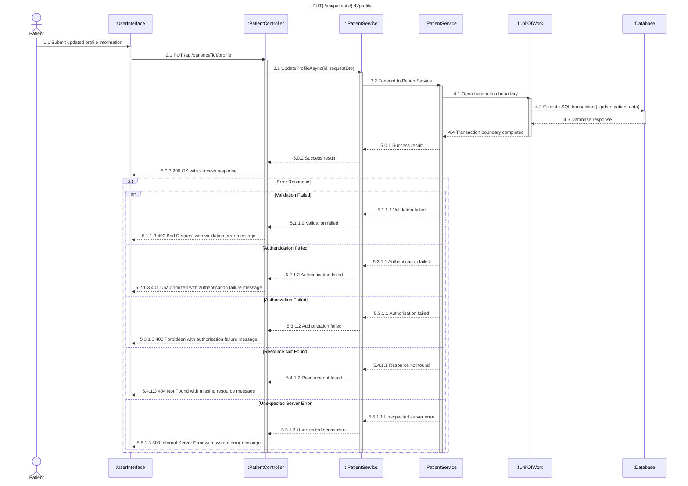
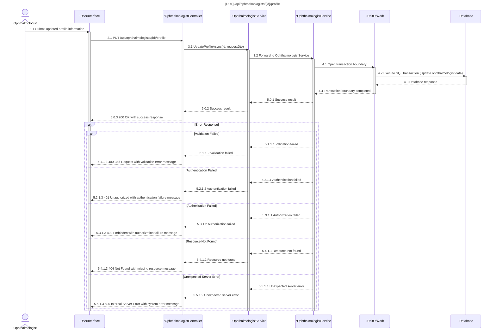
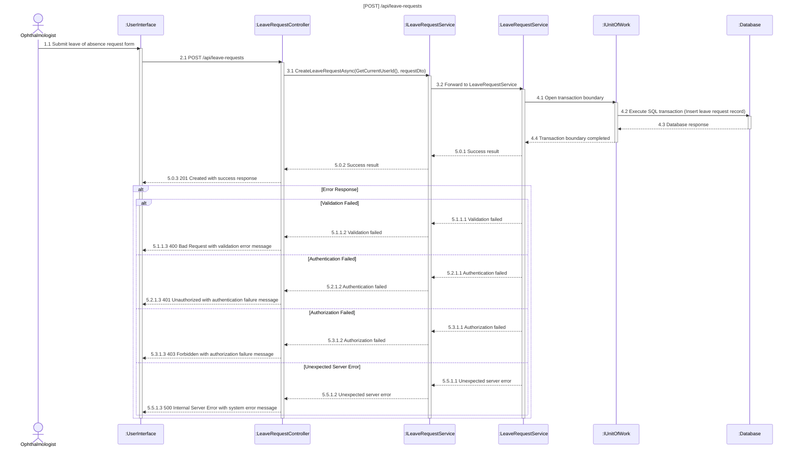
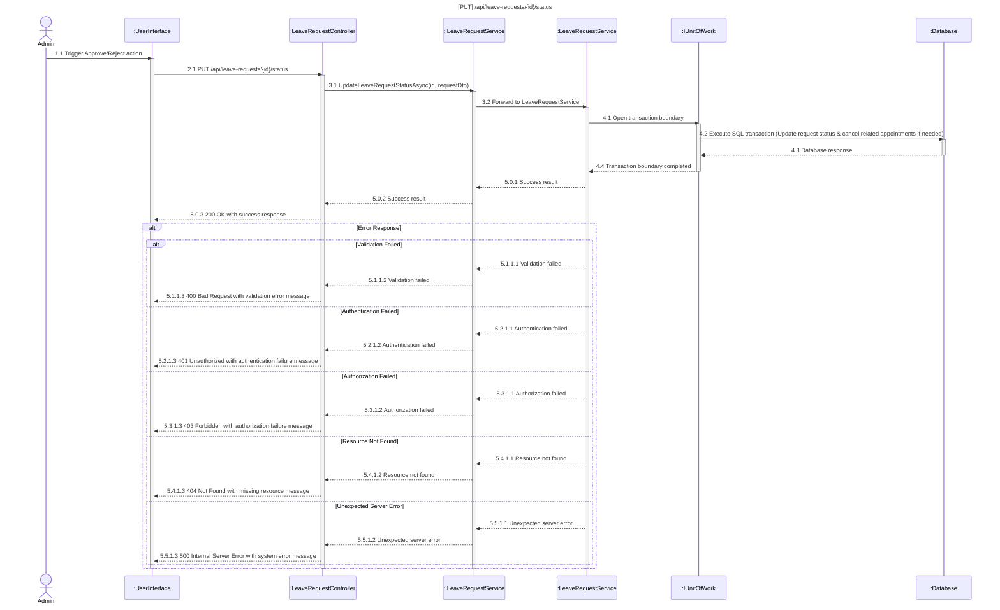

# Profile & Leave Management Sequence Diagrams

## 3.2.1 Manage Patient Profile

## 3.2.2 Manage Ophthalmologist Profile

## 3.2.3 Submit Leave of Absence Request

## 3.2.4 Process Leave of Absence Request

