# Activity Diagrams (PlantUML)

Sơ đồ Activity dưới đây được ánh xạ từ các Sequence Diagram đã thực hiện trước đó, sử dụng định dạng **PlantUML** với layout dạng swimlane (`|Actor|`).

## 1. Register Patient Account

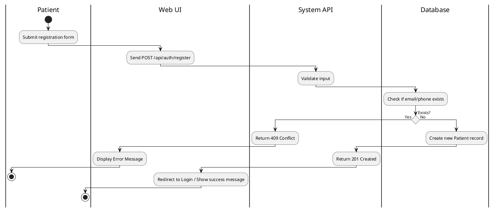

## 2. Patient Login

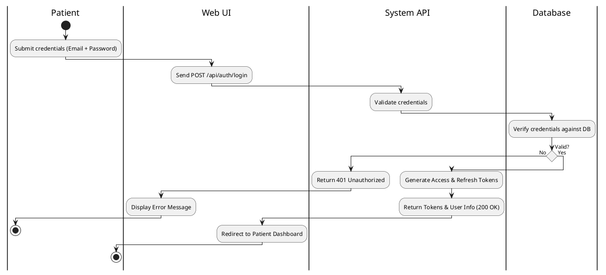

## 3. Internal Staff Secure Login

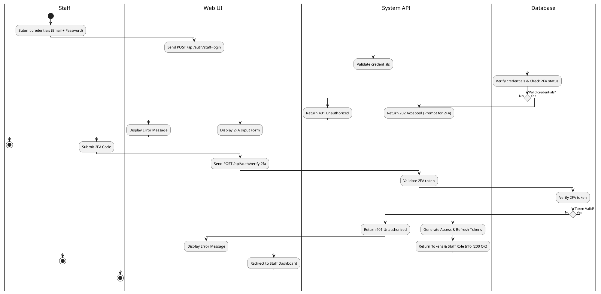

## 4. Manage Internal Accounts & RBAC Policies

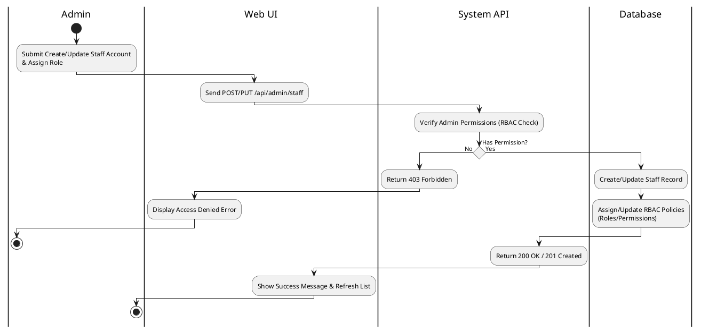

## 5. 2FA Enable

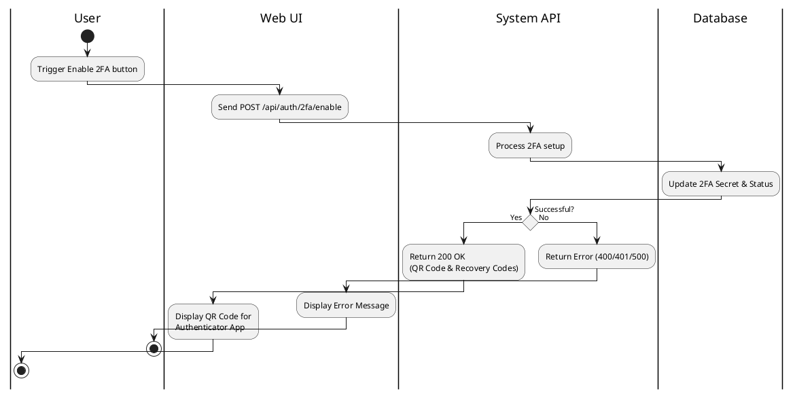

## 6. Forgot Password

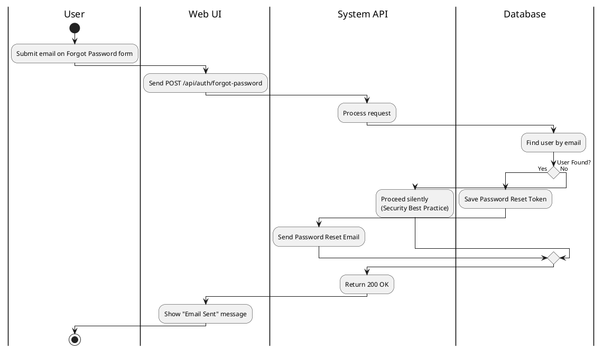

## 7. Change Password

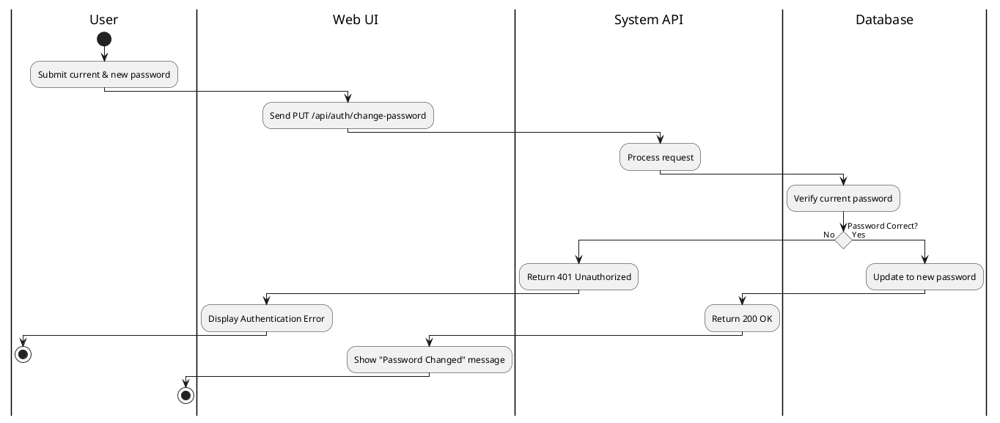

## 8. Manage Patient Profile

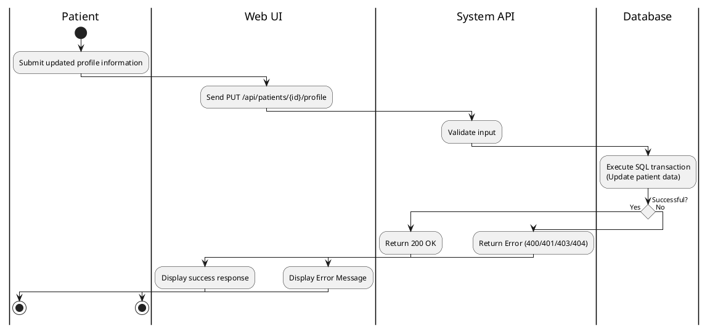

## 9. Manage Ophthalmologist Profile

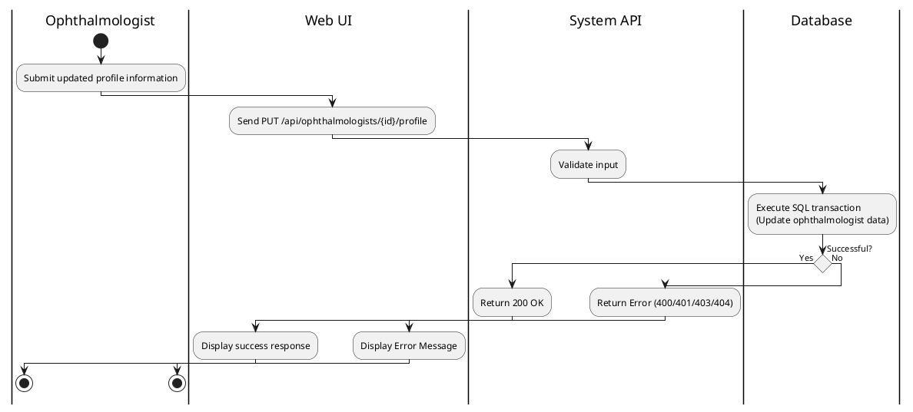

## 10. Submit Leave of Absence Request

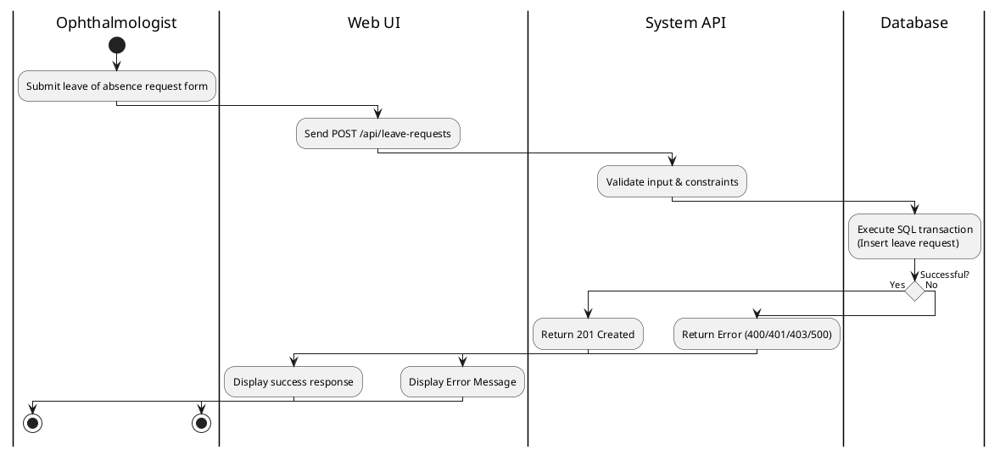

## 11. Process Leave of Absence Request

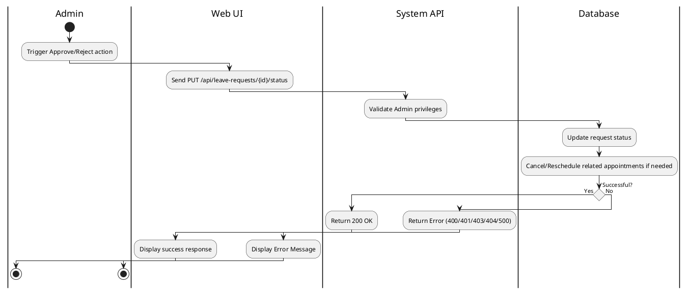
