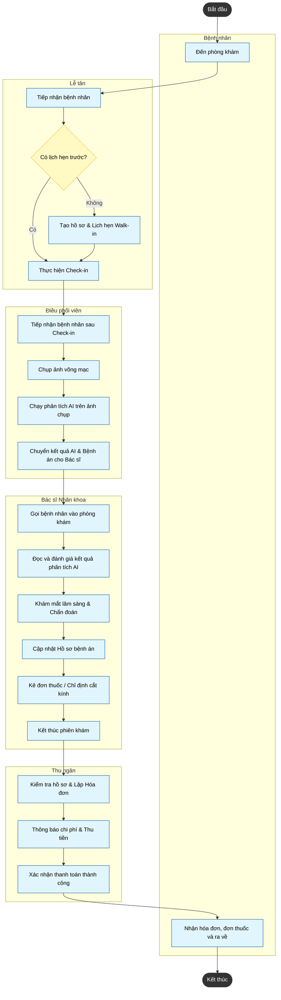

# Activity Diagram: Consultation Flow (Luồng khám và tư vấn)

Sơ đồ hoạt động dưới đây mô tả toàn bộ luồng quy trình khám chữa bệnh thực tế tại **AuraEyes Digital Clinic**. Quy trình bắt đầu từ lúc bệnh nhân bước vào phòng khám, trải qua các bước Check-in, Chụp ảnh võng mạc & AI, Khám bệnh, Tính phí, và kết thúc ở bước Thanh toán thu ngân.

Sơ đồ được thiết kế theo dạng **Swimlanes** (Phân khu theo vai trò), tập trung vào các tác nhân con người vận hành phòng khám:

1. **Patient (Bệnh nhân)**
2. **Receptionist (Lễ tân)**
3. **Coordinator (Điều phối viên)**
4. **Ophthalmologist (Bác sĩ Nhãn khoa)**
5. **Cashier (Thu ngân)**

