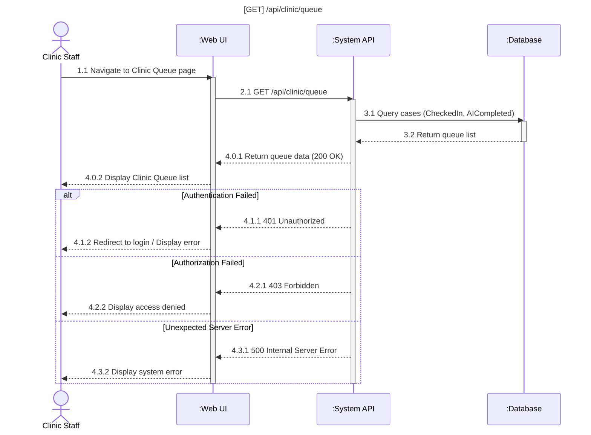
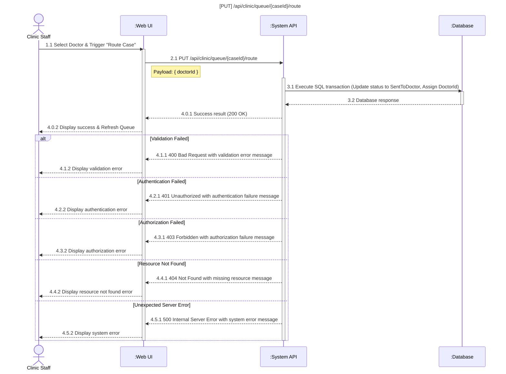
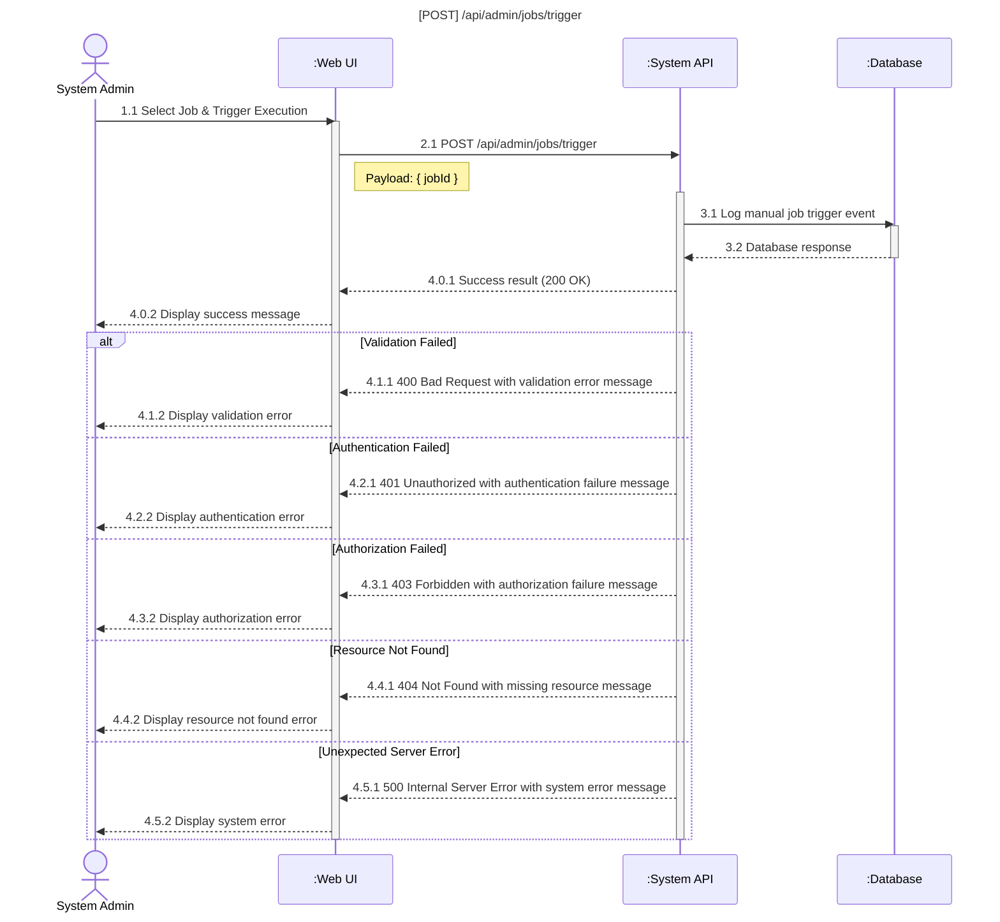
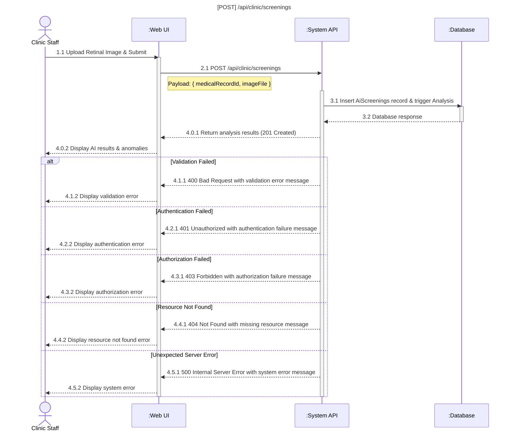
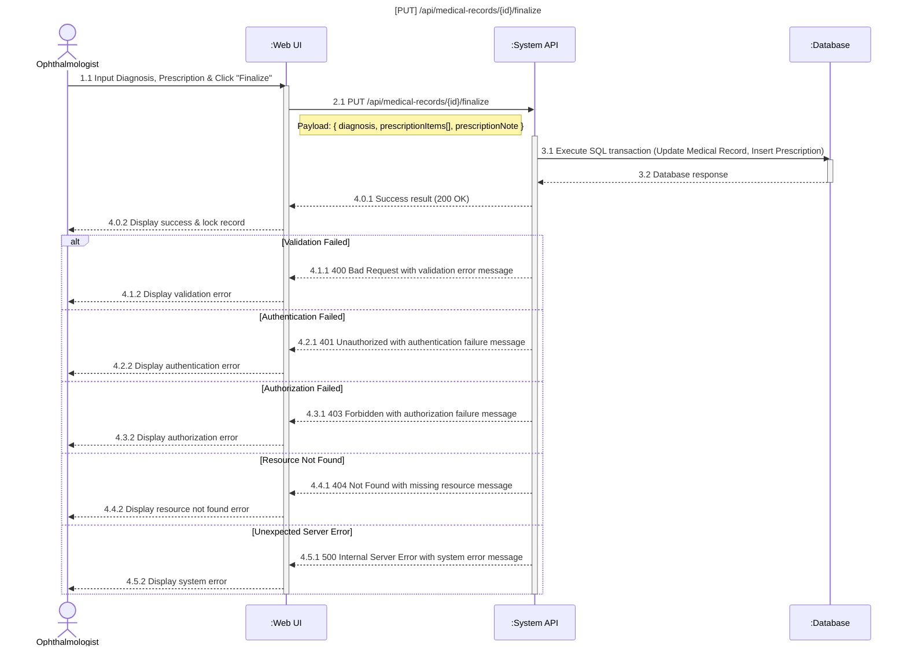

### Manage Clinic Queue & Route Case to Doctor

#### View Clinic Queue

#### Route Case to Doctor

### 3.3.8 Trigger Scheduling Jobs (System Admin)

### 3.4.5 Clinic Screening Operations

### 3.4.8 Create Final Medical Diagnosis & Prescription

